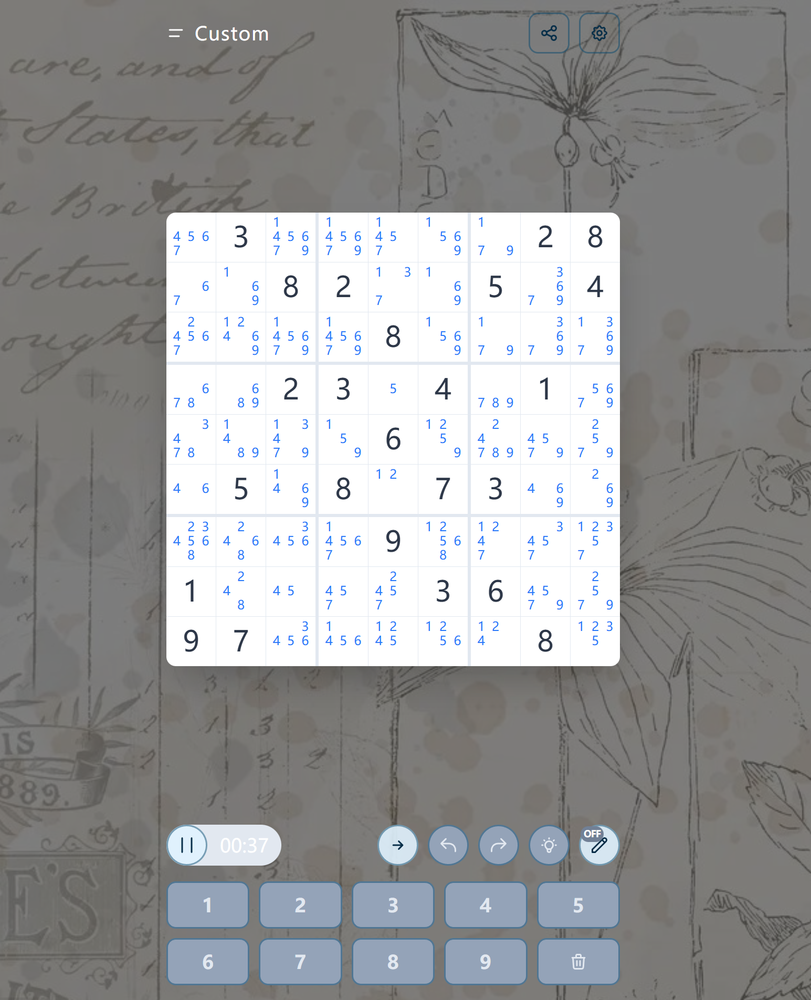
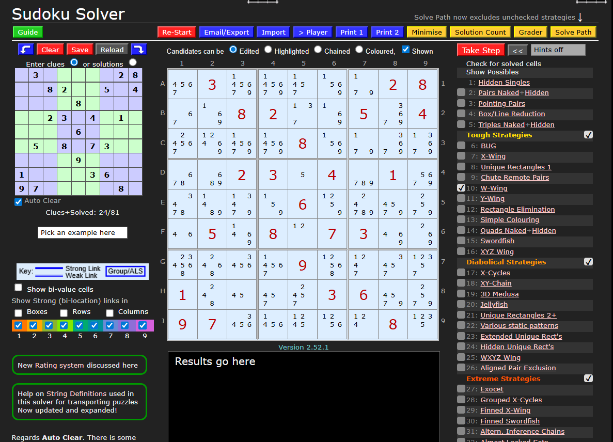
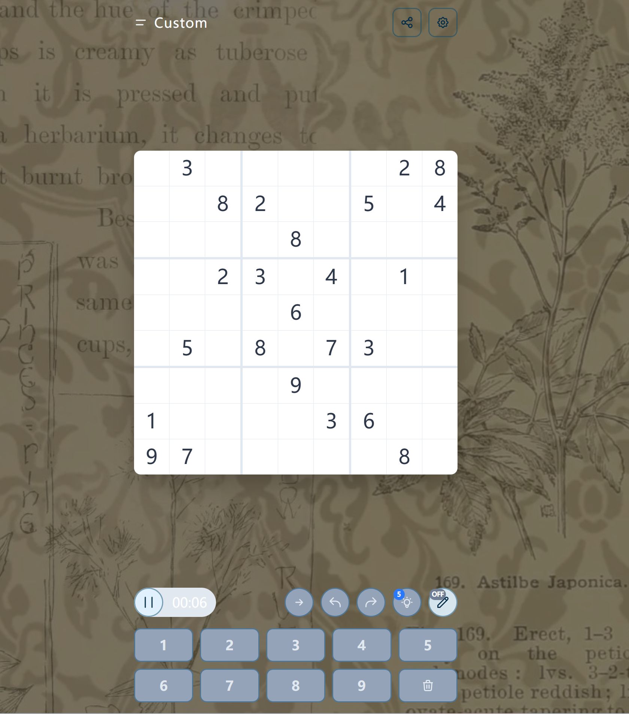

---

# 设计说明

## 1.回溯（Undo / Redo）机制设计

本项目中的回溯功能采用**基于状态快照（Snapshot）的历史管理机制**实现。所有会改变游戏状态的操作（如填入数字、清空单元格、编辑候选数、应用提示等）都**不会直接修改棋盘或相关状态**，而是统一通过 `HistoryManager.applyChange` 方法执行。

在该方法中，系统会在操作执行**前后**分别生成一次完整的游戏状态快照（`GameStateSnapshot`）。当检测到状态确实发生变化后，系统会将**操作前的快照**压入撤销栈（undo stack），并清空重做栈（redo stack）。
当用户触发撤销或重做操作时，历史管理器只需从对应栈中取出快照，并通过快照服务将其整体应用回当前状态，从而恢复棋盘、候选数以及提示次数等信息。

通过这种方式，回溯功能在实现上**不依赖具体的操作类型**，而是统一基于“状态前后对比与恢复”的机制完成。

### 设计依据

* **单一职责原则（SRP）**
  输入组件只负责触发操作，`HistoryManager` 只负责历史栈管理，`GameStateSnapshot` 只负责状态捕获与恢复，各对象职责清晰、相互解耦。

* **一致性保障**
  回溯基于完整状态快照而非指令或差量修改，确保棋盘、候选数、提示次数等状态始终同步，避免局部回滚导致的不一致问题。

* **良好的扩展性与可维护性**
  若未来需要将更多状态（如计时器、游戏模式等）纳入回溯范围，只需扩展快照对象即可，无需修改历史管理或 UI 逻辑。

---

## 2.题目导入设计

本项目将“题目导入”设计为一项**独立的业务能力**，核心思路是将用户输入的多种题目表示形式，统一转换为内部标准格式（`sencode`）。

无论用户输入的是已有的 `sencode` 字符串、第三方网站的题目链接，还是直接粘贴的 81 位题面字符，系统都会通过**统一的导入入口**进行解析。
导入流程由题目导入器（Importer）负责协调：它会按顺序尝试多种导入策略，每种策略分别判断输入是否可处理，并在匹配成功时完成解析与转换，最终输出标准化的 `{ source, sencode }` 结果。

UI 层只需调用导入器提供的校验与转换接口，即可在不关心具体输入格式差异的情况下完成题目导入和自定义开局。

### 设计依据

* **开闭原则（OCP）**
  通过基于策略的导入方式，系统可以在不修改核心导入逻辑的前提下灵活支持新的输入格式。

* **职责分离**
  导入逻辑与游戏流程严格解耦，题目解析规则的变化不会影响数独棋盘状态或对局控制逻辑。

* **统一内部表示**
  将所有输入统一转换为 `sencode`，简化了后续流程，使游戏启动、分享、URL 解析和存档等功能均可复用同一数据格式，减少重复处理和潜在错误。

---

## 3 策略集成与提示系统设计

本项目在进入游戏后提供两种模式：**作弊版**与**求解版**。该设计参考了 [SudokuWiki](https://www.sudokuwiki.org/Sudoku.htm) 中对数独推理步骤的分类与展示方式。

其中作弊版的棋盘为

对应的[SudokuWiki](https://www.sudokuwiki.org/Sudoku.htm)上的棋盘为

作弊版仿照[SudokuWiki](https://www.sudokuwiki.org/Sudoku.htm)的功能，开发了next step的设计，自动进行下一步数独的求解，可使用的次数为无限次

求解版的棋盘为

对应的[SudokuWiki](https://www.sudokuwiki.org/Sudoku.htm)上的棋盘为

求解版依照原项目的设计，只有五次，功能与作弊版的next step类似

下面是这两个的详细设计解读

---

### 3.1 作弊版（Next Step）设计

在作弊版中，玩家可以使用“下一步（Next Step）”功能，查看当前局面下系统推荐的下一条推理步骤。

#### 1）用户点击到结果落地的完整链路

入口按钮位于 `Actions.svelte`，仅在作弊版（`$gameMode === 'cheat'`）可用。点击后流程如下：

1. 调用 `game.pause()`
2. 执行 `const result = nextStepProcessor.processStep()`
3. 打开 `NextStep` 模态框展示结果
4. 若用户点击 Apply：
   使用 `history.applyChange` 包裹
   `resultApplier.applyNextStepResult(result)`
   使该操作支持撤销与重做

---

#### 2）NextStepProcessor：三步循环 + 策略选择

`NextStepProcessor.processStep()` 是 Next Step 的核心流程编排器，一次点击只返回一个用于 UI 展示的结果对象。

**步骤一：Check for solved cells（删冲突候选）**

* 调用 `candidateManager.checkForSolvedCells(grid, candidates)`
* 遍历已填数字，删除同行 / 同列 / 同宫中的冲突候选
* 若产生删除，立即返回 `type: 'eliminate'`

**步骤二：Show Possibles（裸单定值）**

* 调用 `candidateManager.showPossibles(grid, candidates)`
* 查找候选数仅剩 1 个的格子
* 若存在，返回 `type: 'solve'`

**步骤三：Strategies（41 个策略）**

* 先单独执行 Hidden Singles（`id === 1`），若有结果直接采用
* 否则对其余策略并行执行，统计删候选数量
* 选择删除数量最多的策略作为结果

**无结果处理**

* 若棋盘已无空格：返回 `type: 'complete'`
* 否则返回 `type: 'skip'`，表示本轮所有步骤均被跳过

---

#### 3）ResultApplier：统一结果落地

`NextStepProcessor` **只负责计算**，不直接修改 store。所有状态变更统一交由 `ResultApplier` 处理：

* `solve`：清空该格候选数并写入数字
* `eliminate`：逐条删除候选数

UI 组件 `NextStep.svelte` 仅负责展示结果，并在用户确认时调用注入的 `apply()`，不感知任何业务逻辑。

---

### 3.2 求解版（Hint）设计

在求解版中，玩家仅有 **5 次提示机会**。提示功能的目标不是展示完整推理过程，而是**给出一个可确定填写的数字**。

#### 1）用户点击到结果落地的完整链路

入口同样位于 `Actions.svelte`，仅在求解版且仍有提示次数时可用：

1. 保存用户原始候选数（`originalCandidates`）
2. 调用 `hintStrategyManager.executeStrategies()`
3. 打开 Hint 模态框展示结果
4. 若用户点击 Apply：

   * 扣减提示次数
   * 使用 `history.applyChange` 包裹
     `resultApplier.applyHintResult(suggestion, originalCandidates)`

---

#### 2）HintStrategyManager：适配器模式

Hint 系统通过 **适配器模式**复用了 Next Step 的策略体系。

* 所有策略仍只负责“删候选数”
* `HintStrategyManager` 将“删候选”结果适配为“可填数字”的提示

**阶段一：补齐候选数（不覆盖用户输入）**

* 对没有候选数的格子自动补齐
* 记录自动补齐的候选数，用于后续清理

**阶段二：多步循环推导**

在深拷贝的 grid / candidates 上执行：

1. 删冲突候选
2. 查找裸单
3. 执行策略并删候选
4. 每次删候选后立即检查是否产生 Naked / Hidden Single

---

#### 3）SingleFinder：查找逻辑复用

`SingleFinder` 提供统一的单数查找能力：

* `findNakedSingle`
* `findHiddenSingle`

Hint 系统在策略执行后复用该能力判断是否已可确定填数。

---

#### 4）结果应用：恢复状态并填数

`ResultApplier.applyHintResult` 包含两个步骤：

1. 恢复用户原始候选数（清除自动补齐部分）
2. 填入提示数字并清空该格候选数

---

### 设计依据总结

从面向对象设计角度看：

* **适配器模式**：在不修改任何策略实现的前提下，将“删候选”策略适配为“填数字”提示
* **职责分离**：Hint 与 Next Step 各自独立，互不影响
* **副作用隔离**：通过深拷贝计算与统一恢复，避免污染用户状态
* **代码复用**：共享 `candidateManager`、`singleFinder` 与完整策略集合
* **良好的扩展性**：新增策略后，Next Step 与 Hint 均可自动支持

### 使用说明：
使用说明：
1.npm install --legacy-peer-deps
2.npm run dev
---
